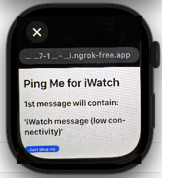

# My personal iWatch chatter #

Assume you are without your mobile, just a smart watch and Wi-Fi. And you'd like to chat with someone.

ping-me will supply such ability: from the watch, use Surfify (or Safari hidden browser (from iMessages)) to browse to some basic web-site, and ping your buddy ~~along with your geo-location~~.

Now your buddy can text you using WhatsApp - in which answering is possible.

## Usage

- Download latest Chrome driver from 

    https://googlechromelabs.github.io/chrome-for-testing/ --> 

    https://storage.googleapis.com/chrome-for-testing-public/136.0.7103.49/win64/chromedriver-win64.zip

- `ngrok http 8080`

- Browse to this url - like https://abcd-12-345-678-90.ngrok-free.app/ - in the iWatch

- Run

######       
    chrome --remote-debugging-port=9222 --user-data-dir="c:\repos\selenium\ChromeProfile"

- open it to a linked WhatsApp web instance https://web.whatsapp.com/

- non default recipient should be pinned at WhatsApp, otherwise it won't be found during run-time

- Remember the chosen password (application.properties). Defaulted to `1234`

- `mvn spring-boot:run -Dspring-boot.run.arguments=--recipient.target=Elvis`

- Browse to http://localhost:8080/index.html just to make sure utility is up and running

- On Windows > Control-Panel > System > Power & Batter make sure your device won't sleep/ hiberante after X hours

- [chrome://settings/performance](chrome://settings/performance) > add `web.whatsapp.com` to the 'Always keep these sites active' list

## TODO

- ~~html text field for the recipient (empty for the server config). For that on WhatsApp web, focus on the favorites list~~

- Cloud
- WebSocket
- Open Chat like https://matrix.org/

## Bonus

Emoji dictionary, see https://shahart.github.io/ping-me/emojies.html. Thanks to Issue #3

